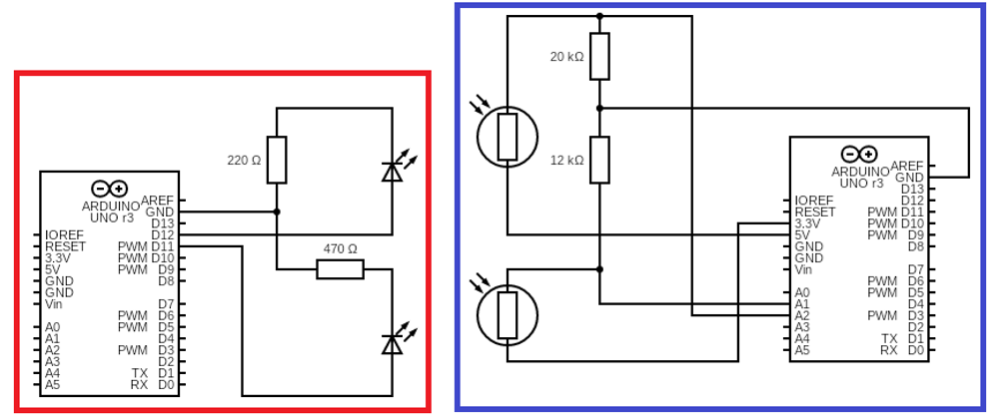
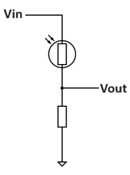
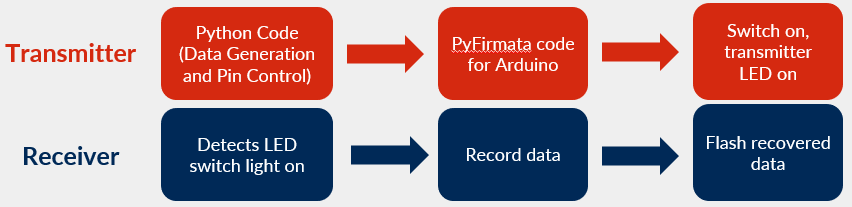
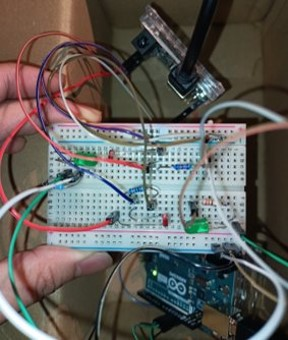

# 8-Bit Data Transmission Using LED Visible Light Communication

This project is part of my **Measuring Techniques and Systems** class at the [University of Jyväskylä](https://www.jyu.fi/en) last December 2023 during my Erasmus Mundus [RADMEP](https://master-radmep.org/) program. This was a group project with Nico and Ale where I was mostly responsible for the _design_, _characterization_, and _signal transfer/acquisition_.

## 1. Materials
To achieve this project, the following materials were used:
- (2) Arduino UNO
- (2) 525-nm/Green LEDs
- (2) Adafruit 161 Photoresistors
- Resistors (470 Ω, 12 kΩ, 20 kΩ)
- Connector wires
- Analog Discover 2

## 2. Schematic
Below is the schematic of the transmitter (in red) and receiver (in blue) circuits, both of which contain Arduino UNO microcontrollers to handle signal transfer and acquisition. This schematic was created from this website [here](https://www.circuit-diagram.org/editor/).

The basic operation involves an LED turning **ON** and **OFF** whose blinking sequence depends on the selected number from 0-255. The chosen number of bits is 8, which is enough to cover the entire range.
To inform the receiver side of an incoming signal, additional LED-photoresistor pair was added.

## 3. Photoresistor Characterization
The next step was to identify which is signal is **ON** or **OFF**, and this would depend on the photoresistor response to the 525-nm LED used. Below is the schematic of the photoresistor response to LED blinking in a dark environment:

where **Vout** was measured. Below is the photoresistor response to different resistors values with the LED having a 0.1-s interval between successive blinks:

The 20 kΩ-resistor was later on chosen for the circuit. Zooming in to the photoresistor respose at 20 kΩ:

  

The red dashed line was set to be the boundary above which bit is considered **ON** and **OFF** otherwise. The green dashed lines correspond to the ideal LED blinking response; however, the transition from light to dark was not as abrupt as the inverse transition. If the sampling rate was chosen to be identical to that of the green dashed lines, then it would not reliably recover the information because there are originally **ON** bits that are considered **OFF** by the photoresistor. To address this, smaller transfer rate was implemented on the transmitter side.

## 4. Setup Specifications
These were the final details of the setup:
- Device should be in a **black box**
- Transmitter LED to receiver photoresistor distance: **0.5 cm**
- Transfer rate: **0.6 bit/s (1.5 s per bit)**
- Data transmission limited only to **numbers from 0-255**
- pyFirmata used to control Arduino UNO pins in Python

  

Below is the actual image of the project circuitry:

  

## 5. References

LED data transmission
- [https://www.youtube.com/watch?v=IdU6eCJ9Rh0](https://www.youtube.com/watch?v=IdU6eCJ9Rh0)
- [https://youtube.com/watch?v=fZRwGFk6bZo](https://youtube.com/watch?v=fZRwGFk6bZo)

Software interface using Tkinter
- [https://www.geeksforgeeks.org/create-first-gui-application-using-python-tkinter/?ref=lbp](https://www.geeksforgeeks.org/create-first-gui-application-using-python-tkinter/?ref=lbp)

Creating circuit diagrams
- [https://www.circuit-diagram.org/editor/](https://www.circuit-diagram.org/editor/)
